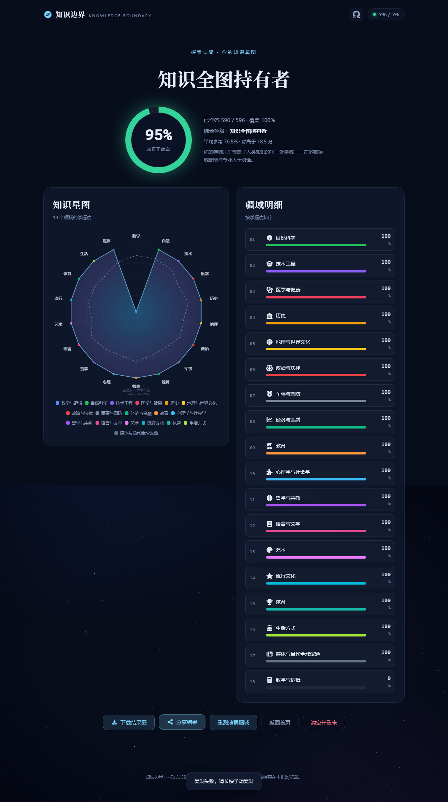

<div align="center">

# 知识边界 · Knowledge Boundary

### 你的知识，止于何处？

**596 道题 · 横跨 18 大知识领域 · 探测你知识面的疆域边界**

[🔗 在线体验 → **kn-bo.130923.xyz**](https://kn-bo.130923.xyz)


</div>

从量子力学到世界杯，从《论语》到烘焙发酵，从星座天体到二次元迷因——这是一项以 596 道题丈量通识疆域的实验。每一道题都在测量你某一领域里的**知晓深度**，最终汇成一张只属于你的**知识星图**。

> 🖱️ 点击下方三张截图，预览完整体验。

## 截图预览

| 首页 · 知识疆域 | 答题 · 即时反馈 | 结果 · 知识星图 |
| :-: | :-: | :-: |
|  |  |  |

## 它有什么

- **18 大领域 · 596 道题**（约 26% 易 / 55% 中 / 19% 难），按知识体量赋权，从自然科学到二次元全覆盖
- 单选四选一，**干扰项均为真实易混淆内容**——答对需要真区分力，而不是猜
- **作答即锁定**：选完不能改；答对自动进下一题，答错停留看清解析、手动点下一题
- **「我手滑了」×5**：答错可消耗机会改判为「这题我确实会」，全程限 5 次
- **答满 100 题**后，任何时刻都能查看当前结果，看完可继续作答
- **实时保存**：每答一题即写入 localStorage，刷新 / 误关不丢进度，可随时继续
- **难度加权计分**：易 ×1 / 中 ×1.5 / 难 ×2，硬题更能拉开「精通度」
- **结果可视化**：18 轴雷达图（知识星图）+ **参考平均虚线**对比 + 领域排名 + 综合等级称号
- **下载结果图**：一键导出你的知识星图（图片自带本项目链接）
- **一键分享**：Web Share / 复制结果文案，把成绩发给朋友
- **重测薄弱疆域**：一键只重做低于 65% 的领域

## 知识疆域一览

| 领域 | 权重 | 领域 | 权重 |
| :-- | --: | :-- | --: |
| 🔬 自然科学 | 74 | 📈 经济与金融 | 33 |
| 💻 技术工程 | 50 | 🔢 数学与逻辑 | 30 |
| 🏛️ 历史 | 40 | 📚 语言与文学 | 30 |
| ⚖️ 政治与法律 | 35 | 🎨 艺术 | 35 |
| 🌍 地理与世界文化 | 35 | 🌟 流行文化 | 35 |
| ⚽ 体育 | 35 | 🍰 生活方式 | 35 |
| 🩺 医学与健康 | 34 | 🧠 哲学与宗教 | 25 |
| 🧩 心理学与社会学 | 25 | 🎖️ 军事与国防 | 15 |
| 📰 媒体与当代全球议题 | 15 | 🎓 教育 | 15 |

权重 = 该领域题目数，按知识体量赋权，合计 596。

## 结果说明

- **加权正确率**：按难度加权后的总得分（非简单对错率）
- **知识星图**：18 轴雷达图，每轴一个领域；空心点 = 该领域作答不足 50%，仅供参考
- **等级称号**：知识萌芽者 → 常识探索者 → 通识学习者 → 博学多识者 → 知识灯塔 → 知识全图持有者

## 快速开始

纯静态站、零依赖、零构建，离线也能跑：

```bash
# 方式一：直接双击 index.html
start index.html

# 方式二：本地静态服务器
python -m http.server 8000    # → http://localhost:8000

# 方式三：node
npx serve .
```

> 需要 Node 环境的只有开发工具（题库校验 / 测试）；网站本身不需要。

## 开发与数据

- `data/taxonomy.md` — 领域分类设计文档（含跨域归属规则）
- `data/question-spec.md` — 出题规范
- `data/questions/*.js` — 题库（每领域一个文件，共 596 题）
- `js/domains.js` — 领域体系与权重

```bash
npm install          # 安装 Playwright（仅测试需要）
npm test             # = 题库校验 + 端到端冒烟测试
npm run validate     # 题库结构 / 难度 / 答案位置校验
npm run audit        # 长度失衡审计（选项别太明显的把关）
```

## 隐私

所有答题数据仅保存在**你自己的浏览器 localStorage**，零网络请求、零上传。

## 许可

[MIT](LICENSE)
